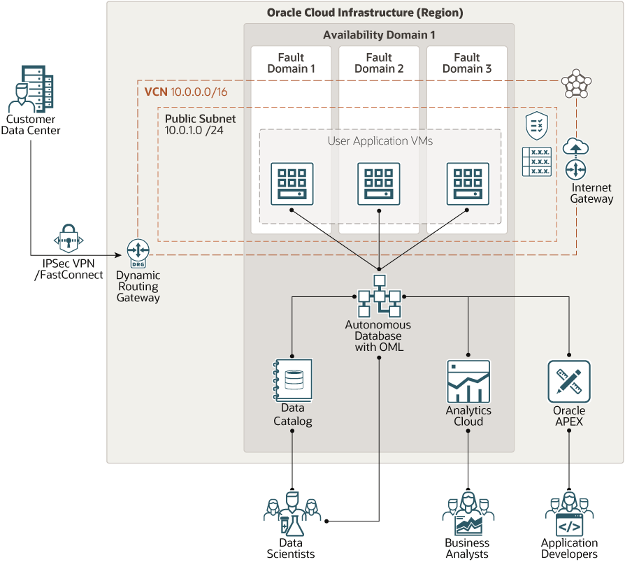

# oci-arch-data-science

Oracle Machine Learning is embedded in both Oracle Autonomous Data Warehouse and Oracle Autonomous Transaction Processing. Because the machine learning algorithms are resident in the database, data scientists can avoid the time, effort, and expense of moving the data to external systems for analysis and model building, scoring, and deployment.

## Terraform Provider for Oracle Cloud Infrastructure
The OCI Terraform Provider is now available for automatic download through the Terraform Provider Registry. 
For more information on how to get started view the [documentation](https://www.terraform.io/docs/providers/oci/index.html) 
and [setup guide](https://www.terraform.io/docs/providers/oci/guides/version-3-upgrade.html).

* [Documentation](https://www.terraform.io/docs/providers/oci/index.html)
* [OCI forums](https://cloudcustomerconnect.oracle.com/resources/9c8fa8f96f/summary)
* [Github issues](https://github.com/terraform-providers/terraform-provider-oci/issues)
* [Troubleshooting](https://www.terraform.io/docs/providers/oci/guides/guides/troubleshooting.html)

## Clone the Module
Now, you'll want a local copy of this repo. You can make that with the commands:

    git clone https://github.com/oracle-quickstart/oci-arch-data-science
    cd adw-with-machine-learning
    ls

## Prerequisites
First off, you'll need to do some pre-deploy setup.  That's all detailed [here](https://github.com/cloud-partners/oci-prerequisites).

Secondly, create a `terraform.tfvars` file and populate with the following information:

```
# Authentication
tenancy_ocid         = "<tenancy_ocid>"
user_ocid            = "<user_ocid>"
fingerprint          = "<finger_print>"
private_key_path     = "<pem_private_key_path>"

# SSH Keys
ssh_public_key  = "<public_ssh_key_path>"

# Region
region = "<oci_region>"

# Compartment
compartment_ocid = "<compartment_ocid>"

# Autonomous Data Warehouse
autonomous_database_admin_password="enter-password-here"

# Oracle Analytics Cloud
analytics_instance_capacity_capacity_type="enter_capacity_type_here"
analytics_instance_capacity_capacity_value="enter_capacity_value_here"
analytics_instance_feature_set="enter_feature_set_here"
analytics_instance_license_type="enter_license_type_here"
analytics_instance_name="enter_OAC_instance_name_here"
analytics_instance_idcs_access_token="insert_user_IDCS_token_here"

````

Deploy:

    terraform init
    terraform plan
    terraform apply

## Destroy the Deployment
When you no longer need the deployment, you can run this command to destroy it:

    terraform destroy

## adb-ml-architecture




## Reference Archirecture

- [Set up a data science environment that uses Oracle Machine Learning](https://docs.oracle.com/en/solutions/data-science-environment/index.html)
- [Creating Applications with APEX in Autonomous Database](https://docs.oracle.com/en/cloud/paas/autonomous-data-warehouse-cloud/user/application-express-autonomous-database.html)